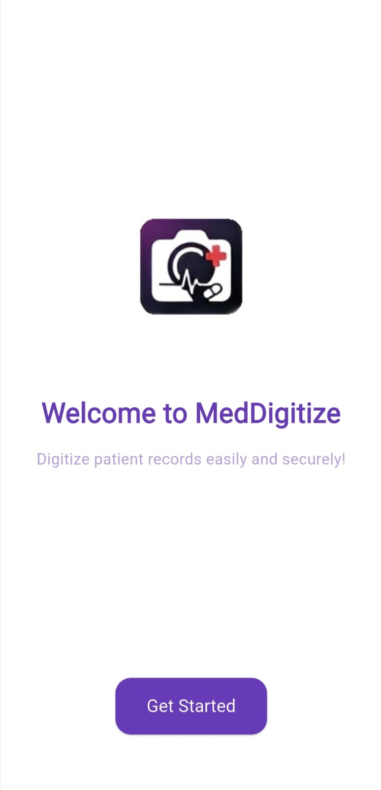
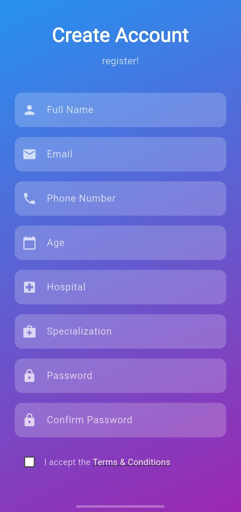
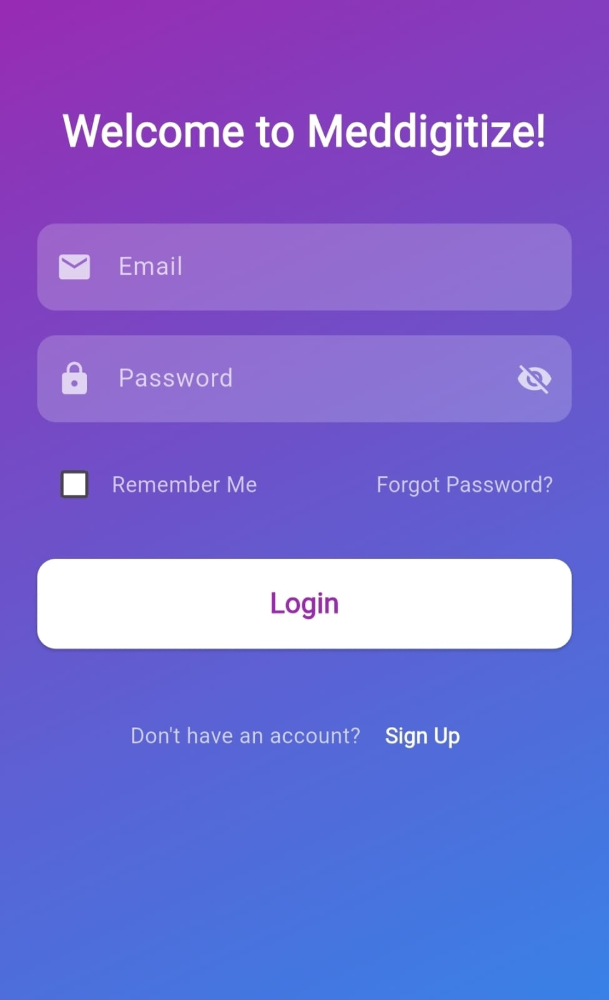
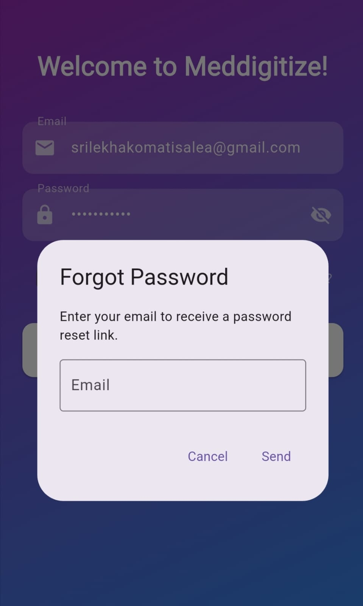
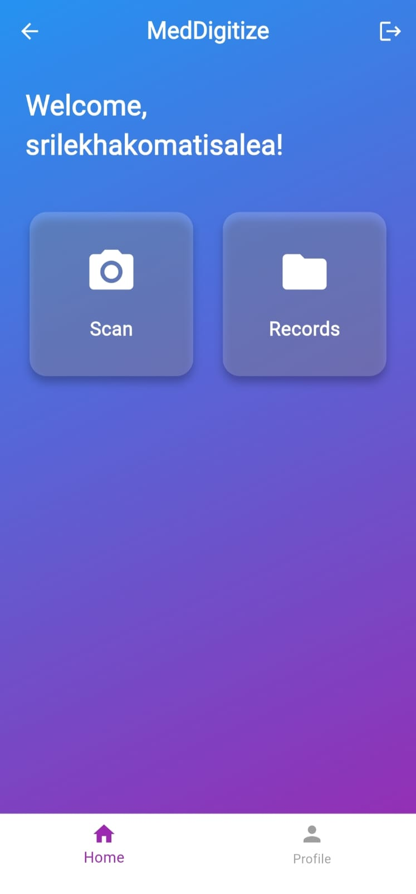
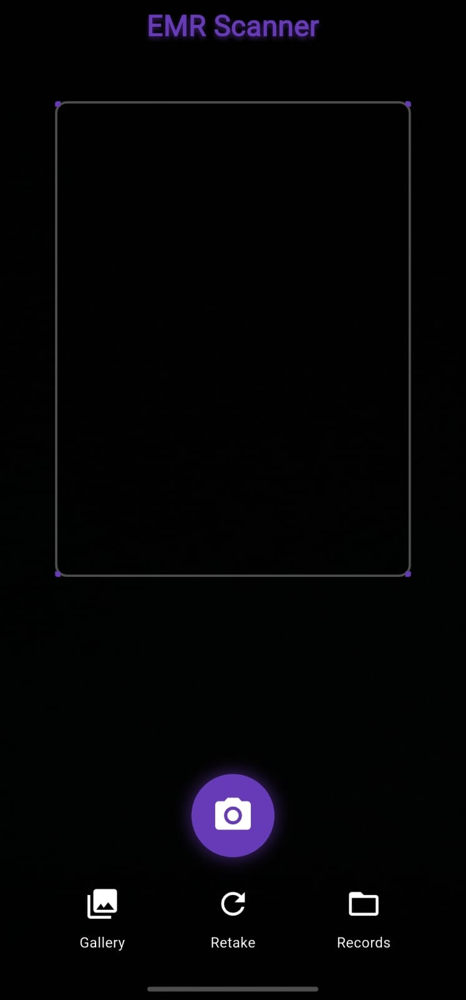
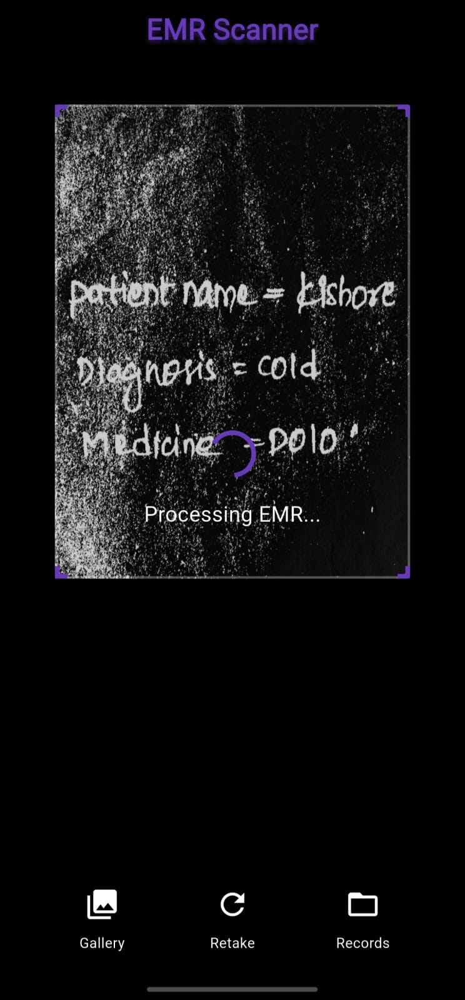
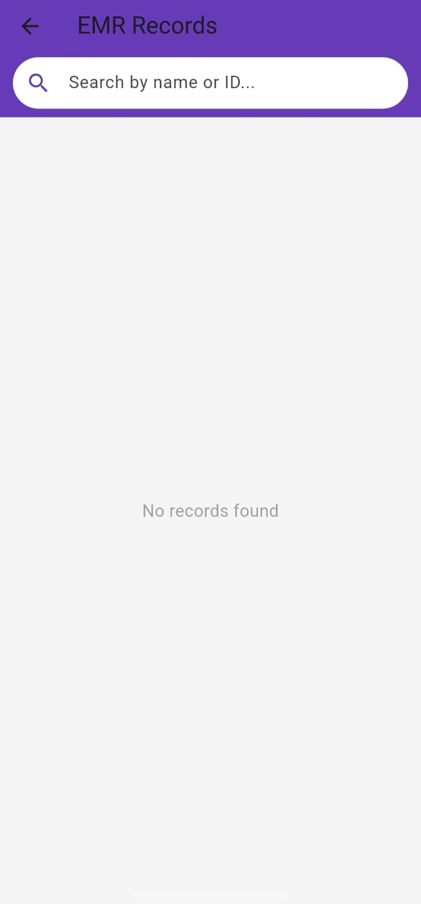

# AI-Powered Text Digitization App

An AI-based mobile application that helps digitize handwritten medical records and convert them into structured Electronic Medical Record (EMR) data using OCR.

## About the Project

Handwritten medical records are difficult to store, search, and manage digitally. This project focuses on automating the digitization process by extracting text from handwritten records and converting the extracted information into structured EMR data.

The application uses Google ML Kit for OCR and a Node.js backend with MySQL for storing and retrieving the processed records.

## Features

* User registration and login
* Forgot password functionality
* Dashboard for managing medical records
* Scan handwritten medical records
* OCR-based text recognition
* Structured data extraction
* Store digitized medical records
* Retrieve stored medical records
* Backend REST APIs

## Tech Stack

* **Mobile:** Flutter
* **OCR:** Google ML Kit Text Recognition
* **Backend:** Node.js
* **Database:** MySQL
* **API:** REST APIs

## How It Works

```text
Handwritten Medical Record
          ↓
      Flutter App
          ↓
    Google ML Kit OCR
          ↓
    Text Extraction
          ↓
Structured EMR Data
          ↓
     Node.js API
          ↓
        MySQL
          ↓
   Record Storage & Retrieval
```

## My Contribution

* Developed the mobile application for digitizing handwritten medical records.
* Implemented the OCR pipeline using Google ML Kit.
* Worked on extracting and structuring the recognized text into EMR data.
* Developed backend REST APIs for storing and retrieving medical records.
* Integrated the backend with MySQL for persistent data storage.

## Screenshots

## Screenshots

### 1. Welcome Screen

<p align="center">
  
</p>

The welcome screen provides the initial entry point to the application.

### 2. Sign Up

<p align="center">
  
</p>

Users can create an account to access the application.

### 3. Login

<p align="center">
  
</p>

Registered users can log in to access their records and application features.

### 4. Forgot Password

<p align="center">
  
</p>

The forgot password screen allows users to initiate the password recovery process.

### 5. Dashboard

<p align="center">
  
</p>

The dashboard provides access to the main application features and medical records.

### 6. Scanner

<p align="center">
  
</p>

The scanner allows users to capture handwritten medical records for digitization.

### 7. Scanning & OCR Processing

<p align="center">
  
</p>

The captured medical record is processed using OCR to extract the available text.

### 8. Records

<p align="center">
  
</p>

Digitized medical records can be stored and retrieved through the application.

## Project Workflow

1. User opens the application.
2. User creates an account or logs in.
3. User accesses the dashboard.
4. User scans a handwritten medical record.
5. Google ML Kit performs OCR-based text recognition.
6. The recognized information is structured into EMR data.
7. The structured data is sent to the backend through REST APIs.
8. The backend stores the information in MySQL.
9. Stored medical records can be retrieved through the application.

## Backend

The Node.js backend provides REST APIs for communication between the mobile application and the database.

The backend handles operations related to:

* Medical record storage
* Medical record retrieval
* Communication between the application and database

## Database

MySQL is used to store the structured medical record information.

The database provides persistent storage for digitized records and allows stored information to be retrieved when required.

## Future Improvements

* Improve recognition accuracy for complex handwriting.
* Improve extraction and validation of medical information.
* Add authentication and role-based access control.
* Improve medical record search and management.
* Add more structured EMR fields.
